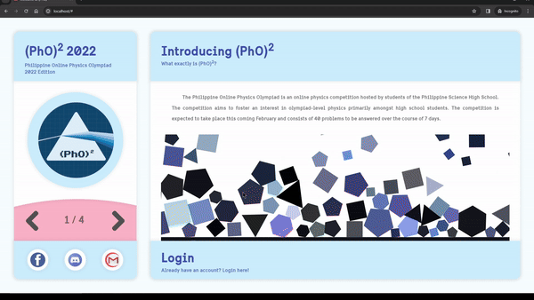
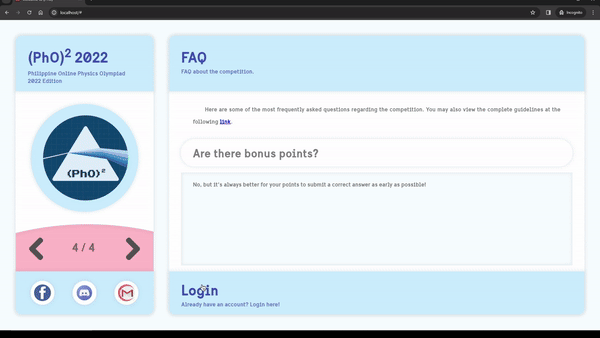
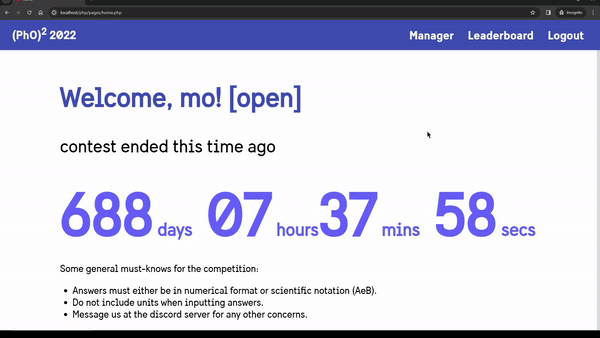
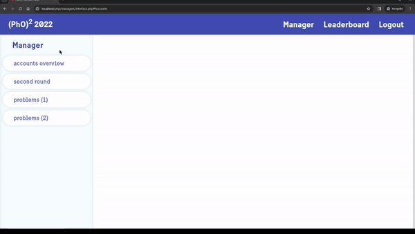
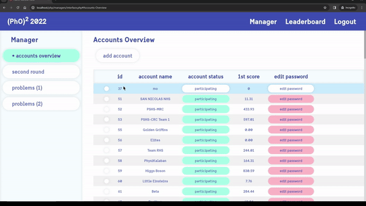
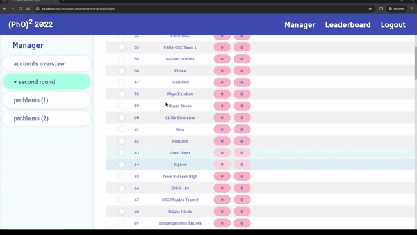
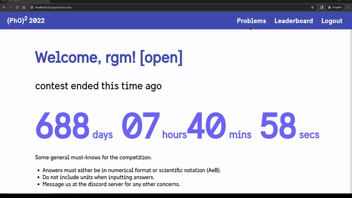
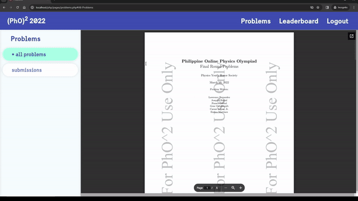
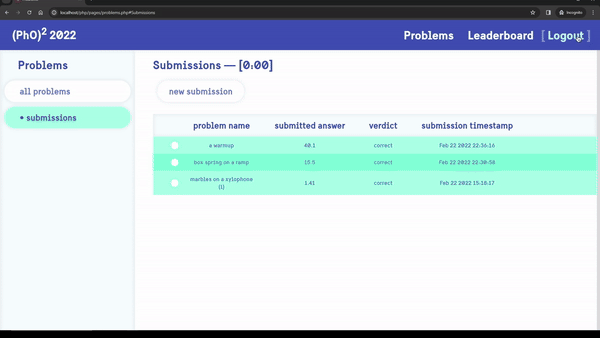

# (PhO)^2 2021 CMS

This was the official Content Management System (CMS) for the first iteration of the Philippine Online Physics Olympiad or (PhO)^2. 
The CMS uses an Apache server with a MySQL database and is written primarily with PHP (for server-side functionalities) and JS (for the client side).
Note that this project is no longer maintained; the current version of the CMS can be found [here](https://github.com/MoDavid1964/PhO-2-Official).

## 1 Dev Story

> // Do soon LMAO; solo devving story, learning php, apache, sql, how servers work, services and jobs (on reboot), first aws adventure, final exam mishap with english comm subject, etc

## 2 About the CMS

When the CMS was initially launced, AWS was used to run and maintain the website. However, although a domain name was also procured for this purpose,
the website is now defunct and can only be run locally by porting the following codebase into XAMPP (specifically, inside the `htdocs/` folder). Nevertheless,
some gifs and screenshots are shown below to portray the original site.

## 2.1 CMS Demos

Here's a showcase of the different aspects of the website, depicted through pictures and GIFs. In retrospect, the website had a rather funky/goofy appeal to its interface;
this contrasts with the current implementation of the CMS, which follows a sleeker design pattern.

### 2.1.1 Landing Page

> **`FIG. 2.1.1.1`** Initial welcome greeting.  

> **`FIG. 2.1.1.2`** The landing page presents a series of interactive physics simulations.  

> **`FIG 2.1.1.3`** The login process.  

---

### 2.1.2 Admin Dashboard

> **`FIG. 2.1.2.1`** Admin dashboard overview.  

> **`FIG. 2.1.2.2`** This is where user accounts can be modified and managed.  

> **`FIG 2.1.2.3`** The accounts depicted here are the teams that made it to the final round.  

> **`FIG 2.1.2.4`** This is where the exact details of each problem can be calibrated by the admins.  

---

### 2.1.3 User Dashboard

> **`FIG. 2.1.3.1`** Initial welcome greeting.  

> **`FIG. 2.1.3.2`** The landing page presents a series of interactive physics simulations.  

> **`FIG 2.1.3.3`** The logout process. Note that the leaderboard (albeit defunct and empty) is also briefly shown before logging out.  

---

## 2.2 CMS Code Breakdown

## 3 The Current CMS

The repo for the current CMS can be accessed [here](https://github.com/MoDavid1964/PhO-2-Official).